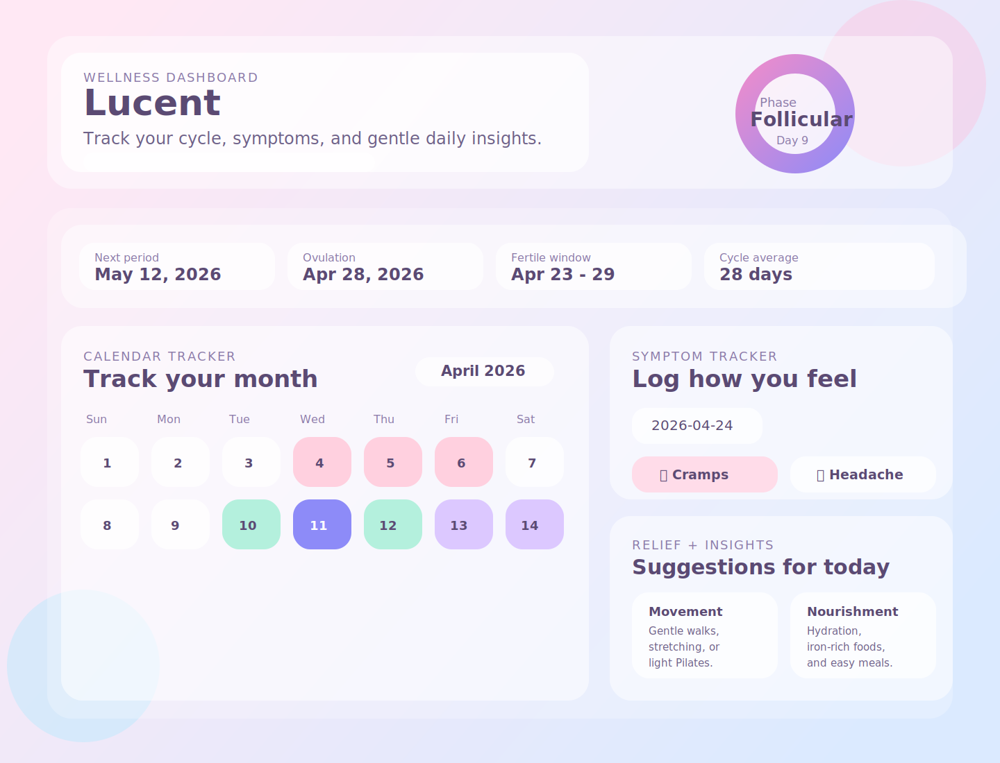

# 🌙 Lucent Cycle

---

### ✨ About Lucent Cycle

Lucent Cycle is a calm and aesthetic cycle-tracking experience  
designed to help users understand their rhythm with clarity and comfort.

Built with simplicity in mind, the app combines  
gentle visuals, intuitive tracking, and a soothing interface 💜

---

### 🌸 Features

🌙 Cycle tracking  
📅 Period predictions  
💜 Mood & symptom logging  
📊 Simple progress insights  
🫧 Minimal and calming interface  
📱 Responsive design  

---

### 🛠️ Built With

---

### 📸 Preview

---

### 🌌 Live Demo

---
